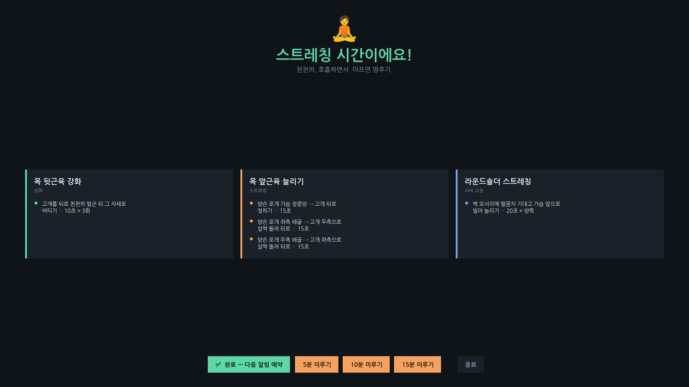

# 목·어깨 스트레칭 알리미 (Windows)

PC를 켜 두면 백그라운드에서 조용히 대기하다가, 설정한 주기마다 **전체화면 스트레칭 알림**을 모든 창보다 앞에 띄워 줍니다. 거북목·라운드숄더 교정용 동작이 기본으로 들어 있습니다.



> 위는 알림이 떴을 때의 화면입니다. (글꼴 대체 환경에서 렌더링한 미리보기이며, 실제 Windows에서는 맑은 고딕으로 표시됩니다.)

노트북과 데스크탑 **양쪽 PC에서 동일하게** 아래 과정을 한 번씩 해 주면 됩니다.

```
stretch_reminder/
├─ stretch_reminder.pyw   ← 본체 (창 없이 백그라운드 실행)
├─ install.bat            ← 시작프로그램 자동 등록 + 바로 실행
├─ uninstall.bat          ← 자동 실행 해제
└─ README.md              ← 이 문서
```

---

## 1단계. Python 설치 (이미 있으면 건너뛰기)

PowerShell이나 명령 프롬프트에서 확인:

```
python --version
```

버전이 나오면 설치된 겁니다. 없으면 <https://www.python.org> 에서 설치하세요.
설치 시 **"Add Python to PATH"** 체크를 꼭 하세요. (install.bat 가 pythonw.exe를 PATH에서 찾습니다.)

> tkinter는 Python에 기본 포함이라 별도 설치가 필요 없습니다.

---

## 2단계. 폴더 배치

이 `stretch_reminder` 폴더를 **고정된 위치**에 둡니다. 예:

```
C:\Tools\stretch_reminder\
```

> 시작프로그램 바로가기가 이 폴더의 `.pyw` 를 가리키므로, 등록 후에는
> 폴더를 옮기지 마세요. 옮겼다면 `install.bat` 를 한 번 더 실행하면 됩니다.

---

## 3단계. 자동 실행 등록 — `install.bat` 더블클릭

`install.bat` 를 더블클릭하면 끝입니다. (관리자 권한 필요 없음)

이 배치가 자동으로 해 주는 일:

1. `pythonw.exe` 위치를 PATH에서 찾고
2. 시작프로그램 폴더(`shell:startup`)에 `Stretch Reminder.lnk` 바로가기 생성
3. (선택) 트레이 아이콘용 패키지(`pystray`, `Pillow`) 설치 시도
4. **지금 바로** 백그라운드에서 한 번 실행

다음 부팅부터는 PC를 켜기만 해도 자동으로 백그라운드에서 돕니다.

> 평소엔 창도 작업표시줄 아이콘도 없습니다. 시간이 되면 전체화면으로 등장합니다.

### 잘 됐는지 확인하려면

`Win + R` → `shell:startup` 입력 → 엔터.
열린 폴더에 **`Stretch Reminder`** 바로가기가 있으면 등록된 것입니다.

> 빠르게 테스트하려면 `stretch_reminder.pyw` 의 `interval_min` 을 잠깐 `1`(분)로
> 바꿔서 실행해 보세요. (확인 후 원래 값으로 되돌리기)

---

## 알림이 떴을 때

- **✅ 완료** — 동작을 마쳤으면 누르세요. 다음 주기가 예약됩니다. (`Esc` 도 동일)
- **N분 미루기** — 지금 바쁘면 5/10/15분 뒤로 미룹니다.
- **종료** (우측 끝) — 오늘은 그만. 프로그램을 완전히 종료합니다. (`Ctrl+Q` 도 동일)

---

## 시스템 트레이 아이콘

작업표시줄 오른쪽 알림 영역(시계 옆)에 작은 아이콘이 생깁니다. 마우스 **우클릭**하면:

- **지금 스트레칭** — 주기를 기다리지 않고 즉시 알림을 띄웁니다. (아이콘 더블클릭도 동일)
- **일시정지 / 재개** — 알림을 잠시 멈췄다가 다시 켭니다. 멈춘 동안 남은 시간은
  그대로 보존돼, 재개하면 이어서 카운트합니다.
- **종료** — 프로그램을 완전히 종료합니다.

> 트레이 아이콘은 `pystray`·`Pillow` 패키지가 있을 때만 나타납니다.
> `install.bat` 가 자동으로 설치를 시도하며, 인터넷이 없거나 설치에 실패해도
> **트레이만 빠질 뿐 알림 기능은 그대로 동작**합니다. 나중에 수동으로 켜려면:
>
> ```
> pip install pystray pillow
> ```

---

## 끄기 / 일시중지

- **잠깐 멈추기:** 트레이 아이콘 우클릭 → **일시정지** (다시 누르면 **재개**).
- **완전히 끄기:** 트레이 우클릭 → **종료**, 또는 알림창에서 우측 **종료** 버튼·`Ctrl+Q`.
  트레이가 없을 땐 작업 관리자(`Ctrl+Shift+Esc`) → 세부 정보 → `pythonw.exe` 종료.
- **자동 실행 완전 해제:** `uninstall.bat` 더블클릭.
  (시작프로그램 바로가기를 지우고, 원하면 실행 중인 프로세스도 종료합니다.)

---

## 주기 바꾸기

`stretch_reminder.pyw` 를 메모장이나 편집기로 열어 맨 위의 이 부분만 수정:

```python
CONFIG = {
    "interval_min": 60,   # ← 여기 숫자 = 알림 주기(분)
    "snooze_options": [5, 10, 15],
}
```

저장 후 다시 실행하면 적용됩니다. (종료했다가 `.pyw` 를 다시 더블클릭하거나 재부팅)

---

## 스트레칭 동작/시간 바꾸기

같은 파일의 `STRETCHES = [...]` 부분에서 동작 이름·태그·설명·횟수를 자유롭게
수정하면 됩니다. 도수치료사가 알려준 정확한 횟수/초가 있으면 거기에 맞춰 고치세요.

---

## 참고 / 동작 방식

- 알림이 뜨면 모든 창보다 **맨 앞에 강제로** 나타납니다(`-topmost`), 뜬 직후 한 번 더
  최상단으로 끌어올려 다른 항상-위 창에 가려지지 않게 합니다.
- 전체화면이라 `Esc` 를 누르면 '완료'로 처리되고 다음 주기가 예약됩니다.
- **중복 실행 방지:** 자동 실행과 수동 실행이 겹쳐도 한 번만 뜹니다(로컬 포트 점유로 단일
  인스턴스를 보장). 그래서 `install.bat` 를 다시 눌러도 알림이 두 번 뜨지 않습니다.
- **절전/최대절전** 후 깨어나 예약 시각이 지나 있으면, 깨어난 직후 한 번만 알림이 뜹니다.
- 타이머는 메인 스레드에서 처리합니다. 트레이 아이콘은 별도 스레드에서 돌지만, 메뉴
  클릭은 큐(queue)를 거쳐 메인 스레드로 전달돼 tkinter를 항상 메인 스레드에서만 다룹니다.
- 게임 등 일부 **전체화면 독점** 프로그램 위에서는 알림이 가려질 수 있는데, 그럴 땐
  게임을 창모드/테두리 없는 창모드로 두면 잘 뜹니다.
